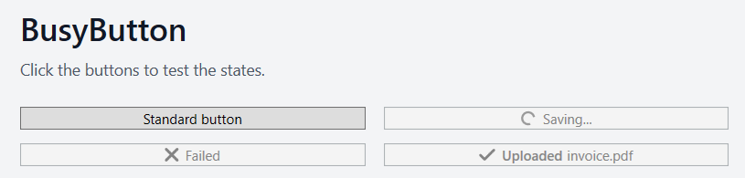

# BusyButton for WPF

A drop-in WPF `Button` with busy, success, and error states.

No custom button chrome. No full UI framework. No visual reset of your application. BusyButton keeps the native WPF button behavior and adds just enough async feedback for real application workflows.

- it inherits from `Button`
- it keeps the standard WPF control template
- it preserves hover, pressed, focus, disabled, layout, and theme behavior
- it adds bindable busy and completion states
- it supports simple text, rich XAML content, and `ContentTemplate`


## Preview



## Quick Start

Declare the namespace:

```xml
xmlns:controls="clr-namespace:BusyButton.Controls"
```

Add the resource dictionary:

```xml
<Application.Resources>
    <ResourceDictionary>
        <ResourceDictionary.MergedDictionaries>
            <ResourceDictionary Source="BusyButton.xaml" />
        </ResourceDictionary.MergedDictionaries>
    </ResourceDictionary>
</Application.Resources>
```

Use the control:

```xml
<controls:BusyButton
    Content="Save"
    BusyContent="Saving..."
    SuccessContent="Saved"
    ErrorContent="Failed"
    FeedbackDuration="0:0:2"
    Click="SaveButton_Click" />
```

If your view model only has a boolean, bind `IsBusy` directly:

```xml
<controls:BusyButton
    Content="Save"
    IsBusy="{Binding IsSaving}"
    BusyContent="Saving..." />
```

For richer workflows, bind the full state:

```xml
<controls:BusyButton
    Content="Save"
    State="{Binding SaveButtonState}" />
```

Then drive it from code:

```csharp
private async void SaveButton_Click(object sender, RoutedEventArgs e)
{
    SaveButton.IsBusy = true;

    try
    {
        await SaveAsync();
        SaveButton.ShowSuccess();
    }
    catch
    {
        SaveButton.ShowError();
    }
}
```

## Rich Content

`Content`, `BusyContent`, `SuccessContent`, and `ErrorContent` can all be objects, not just strings.

```xml
<controls:BusyButton FeedbackDuration="0:0:2">
    <StackPanel Orientation="Horizontal">
        <TextBlock Text="Upload" />
        <TextBlock Margin="6,0,0,0" Text="invoice.pdf" />
    </StackPanel>

    <controls:BusyButton.BusyContent>
        <StackPanel Orientation="Horizontal">
            <TextBlock FontWeight="SemiBold" Text="Uploading" />
            <TextBlock Margin="4,0,0,0" Text="invoice.pdf" />
        </StackPanel>
    </controls:BusyButton.BusyContent>
</controls:BusyButton>
```

## Configurable Properties

| Property | Purpose |
| --- | --- |
| `State` | Shows `Normal`, `Busy`, `Success`, or `Error`. |
| `IsBusy` | Boolean facade for `State=Busy`, useful for simple MVVM bindings. |
| `FeedbackDuration` | How long success/error feedback remains visible before resetting. |
| `BusyContent` | Content shown while busy. Falls back to normal `Content` when omitted. |
| `SuccessContent` | Content shown for success feedback. |
| `ErrorContent` | Content shown for error feedback. |
| `ShowStateIndicator` | Toggles the busy/success/error indicator. |
| `IndicatorSize` | Size of the busy/success/error indicator. |
| `IndicatorSpacing` | Space between the indicator and content. |

## Design Notes

BusyButton does not replace the default `Button` template. That is the main trick, and the main reason it blends in with a normal WPF interface.

The state visuals live in `BusyButton.xaml` as a `DataTemplate`, while `BusyButton.cs` owns the state transitions and dependency properties. This keeps the visual markup easy to tweak without turning the control into a hand-built tree of UI elements.

## Build

Requirements:

- Windows
- .NET SDK with WPF support

Build the sample:

```powershell
dotnet build -c Release
```

Run it:

```powershell
dotnet run
```
